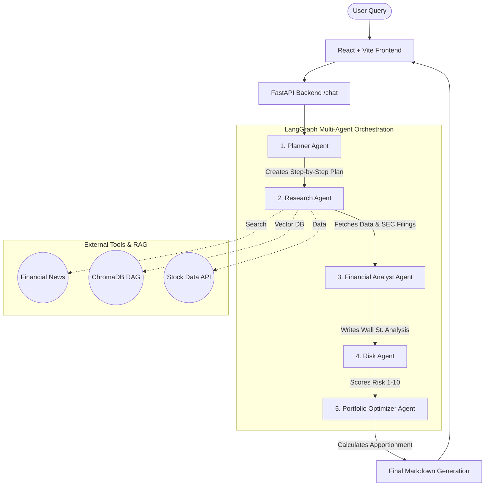

# AI Financial Agent Platform

An enterprise-grade, multi-agent AI financial analysis and portfolio optimization platform. Built with a beautiful, responsive React + Vite frontend, powered by a FastAPI backend orchestrated through LangGraph.

---

## System Architecture & Flow

This platform doesn't just pass queries to an LLM; it orchestrates a specialized **5-Agent Pipeline** where each AI agent holds a specific role in analyzing your request.



### The Agents:

1. **Planner Agent:** Breaks down user queries logically.
2. **Research Agent:** Interfaces with APIs and Vector Databases (RAG) to collect hard data.
3. **Financial Analyst Agent:** Synthesizes the data into a professional analysis (growth, market drivers, outlook).
4. **Risk Agent:** Reviews the analysis and assigns a strict risk factor score.
5. **Portfolio Optimizer Agent:** Uses Modern Portfolio Theory to calculate precise asset allocations.

---

## Tech Stack

### Frontend (Client-Side)

- **Framework:** React 18 + Vite
- **Styling:** Vanilla CSS (Zero-dependency rich UI with dynamic Light/Dark variables)
- **Icons & Rendering:** `lucide-react`, `react-markdown`
- **Networking:** Axios

### Backend (Server-Side)

- **API Framework:** FastAPI, Uvicorn
- **AI Orchestration:** LangGraph, LangChain
- **LLM Provider:** Groq (`llama-3.3-70b-versatile`)
- **Knowledge Base (RAG):** ChromaDB, Sentence Transformers (Embeddings)

---

## Getting Started

### Prerequisites

- Python 3.10+
- Node.js & npm
- A [Groq API Key](https://console.groq.com/keys)

### 1. Clone the Repository

```bash
git clone https://github.com/automationaimascotspincontrol-art/Finance-Agent-Rag.git
cd Finance-Agent-Rag
```

### 2. Setup the Backend

Navigate to the backend directory, install the Python dependencies, and add your API keys.

```bash
cd backend
pip install -r requirements.txt
```

Create a `.env` file in the `backend/` directory:

```env
GROQ_API_KEY=your_groq_api_key_here
TAVILY_API_KEY=your_tavily_key_here
SEC_API_KEY=your_sec_key_here (optional)
```

Run the FastAPI server:

```bash
uvicorn main:app --reload
```

*(The backend runs on `http://localhost:8000`)*

### 3. Setup the Frontend

Open a **new terminal tab**, navigate to the frontend directory, and start the Vite dev server.

```bash
cd frontend
npm install
npm run dev
```

*(The frontend runs on `http://localhost:5173` or similar based on availability)*

---

## Example Prompts to Try

Once the app is running, paste these into the interface:

- **Optimization:** *"Optimize a portfolio for NVDA, TSLA, and AAPL"* (Watch the beautiful Portfolio Panel slide out!)
- **Analysis:** *"Analyze the current market drivers for Nvidia stock."*
- **Risk:** *"What are the core risks of investing in Meta considering industry disruption?"*

---

## UI Features

- **Fluid Light & Dark Mode:** Context-driven theme toggling mapped directly to root CSS variables.
- **Markdown Streaming:** Supports real-time bolding, bullet points, and code block generations formatting.
- **Micro-animations:** Dynamic hover states, message `fadeIn` keyframes, and smooth scroll behaviors.

---

*Built utilizing the latest agentic design patterns.*
